# Mountain Fortress v3
## 15 minutes quick guide
>[!TIP]
>It is highly recommended to read this before playing for the first time.

>[!CAUTION]
>Caution boxes are very important since they contain information to prevent you from getting banned.

This map isn't your typical vanilla map where your factory must grow up.

It is a **cooperative** surviving nomadic vertical map scenario-like.

### Objectives
- Protect the main train at all costs. If it gets destroyed, it is game over.
- To win, you must complete objectives. They are visible using the top-left book button.
  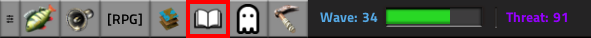
  >[!NOTE]
  >Winning gives us items and stats changes that apply to all future games.

#### TLDR of the gameplay
- We must move north to survive
  >[!CAUTION]
  >Except for the main train - most of the time.
- You may help defend the train from the constant wave of enemies 
- You may help to push north (removing rocks, making lands, killing enemies, laying rails)
- You may mine rocks, over and over and over
- You may build and move mini-bases

### Threads
#### Main threads
- Biters and spiters will constantly spawn south to the main train.
  - Their only objective is to destroy the main train. They will destroy everything in their way.
  - If the train is too far away from the south edge map, they will spawn in between!
    >[!NOTE]
    >As a result, we try to keep the main train south of the map.
  - They spawn closer to the train by spawning nests, so destroy nests!
    >[!NOTE]
    >Destroying nests will spawn some enemies
  - Enemies spawning (including nests) will easily jump over defenses or void!  
    - They spawn as a group of enemies, not just once at a time.
    - Their spawning range is not the same as the vanilla Factorio, which is next to the nests. They spawn _around_ the nests.
    - The game even helps them by spawning lands.
- The south map's south edge is constantly going away.

#### Additional threads
- Mining rocks outside of the train aura may spawn enemies
- Worms are everywhere on the map
- Each map zone is defended by worms, artilleries, turrets flamethrowers, and mines.

### RPG
Each time you mine a rock, kill an enemy, build an item, you will earn some experience points.

Those experience points can be used to level up one of the 5 skills available.
  >[!WARNING]
  >Since you are a new player, the magic one won't be available to use to cast spells. You need to play a non-consecutive 24h to be trusted by the server.

To see your RPG statistics, on the top-left of your screen, in the toolbars, click the [RPG] button.  
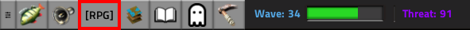

You will be able to see and assign your unsigned points in that window.  
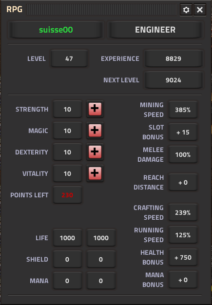
>[!TIP]
>Put your mouse over each of the 5 skills (the label or the number of points assigned) to see what they provide as bonuses.

If you leave the server, your level, experiences and points will be saved until the end of this game.

#### Strength
#### Melee bonus
>[!NOTE]
> To effectively have the melee bonus, your weapon toolbars must be empty of weapons and ammo. You can equip an armor.  
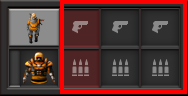

### Resources
#### Ores
- Mining rocks will yield a random ores type in your inventory
- There won't be ore patches on the map. You need to mine rocks to randomly spawn them.

##### Moving ores
- If you are close to the train, bring ores to the train, by hand or by belts. Then:
  - Fill linked chests (white chests) if there are any available next to the train
  - Otherwise, enters the train wagon with fishes in his inventory.  
    - Early one, enter by the left side, it is where all ores chests are.  
    - Later, you will be able to enter pretty much any non-liquid wagons on either side and there will be active chests to receive your ores.
- If you are somewhat far away:
  - Store them in chests near the planified train rails. Usually, it is pretty much spot on the middle of the map.
  - You can also create a mini-base to process them, but you will still store them in chests on-site.
  - If you have a car or a tank you can store them in it, then unload your car near a train.

#### Oils
- Like vanilla. They spawn with the map.

##### Moving crude oil
Pretty much the same idea as for ores with some differences in how we move it.
- We are likely to lay pipes to the train - even from a far distance. Otherwise, store crude oil in tanks.
- If there is no dedicated fluid wagon to take crude oil, you need to fill up barrels and then use linked chests to fill up the train.

#### Overfilling your inventory
The game won't stop you from trying to fill up your inventory, especially when mining rocks.

Unfortunately, if your inventory is full, it will do damage to you on each attempt to fill it more and can lead to killing you.

> [!TIP]
> The game will warn you with a yellow warning above your character when you are close to being full.

> [!TIP]
> Then it will warn you with a red message above your character when you are full as well as the vanilla message (and sound) about your inventory being full.

#### Your corpse
- Will be removed after 15 minutes of his death with all his inventory.
- If you leave the server, after some time, your loot will become available to players.
- There is no penalty (other than your inventory that drops down) to die.

#### Surprises from rocks (or trees/wrecks)
- Mining will always put something in your inventory if there is space:
  - For rocks, it is a random ore type
  - For trees, it is iron for green trees and copper for orange trees
  - For wrecks, it is random items instead of ores!

- Mining can randomly spawn those loot on the map:
  - Coins (used for the market)
  - Items (into a chest or space wreck)
  - An ore patch of one type
  - A mixed ores patch
  - One car (very rare)

- On top of those loot, removing (mining or destroying) can spawn one of those malus:
    >[!CAUTION]
    >Always communicate (via ping, or/and chat) any potential danger or failure to destroy the enemies.
  - Spawn one worm, biters, spiters or a nest.   
    >[!CAUTION]
    >If you mine close to any structure, including near the train but outside the train aura, always make sure you are ready to deal with some enemies by having military gear on you. We highly suggest you make sure such a structure has turrets in case you fail at killing them.    
  - Deploy 3x destroyers or defenders capsules trying to kill you
  - An explosions
  - A poison cloud
  - Teasing you with a threading countdown-like. Once completed, it can spawn any other of the surprises above, or nothing.

#### Free loots from spawners
You will notice lonely assemblers and chemical plants all around the map. Those buildings will spawn, for free, without any input nor power, one item over time.

The item type is random per spawner.

You just need to unload them!

It can buffer up to 200 of such resources.

### No landfill, use explosives!
You will notice the map contains a lot of emptyness and water which can stop you in many ways.

There is no landfill here, we fill up wooden chests with explosives and blow the chests by firing at them (By default using the C key).

>[!TIP]
> We usually fill up chests between 1 (50 explosives) to 3 (150 explosives) full stacks of explosives.

The more explosives you put in the chests, the more they will transform to land, and the bigger the explosion.

Nested explosions will also increase the range of the explosion.

>[!WARNING]
>The explosion will damage buildings, except for rails.

### Defences
#### South of the train
Use walls and turrets. Laser turrets if available.

We also add capacitors nearby, capacitors can recharge your armor batteries here!

Also, we build this same setup, somewhere _far_ north of the train, in case the current south defense fails. Huge mini-bases or big storages are one of the usual spots.

##### Early/Mid game
A shotgun is your friend.

An armor with a lot of personal defense lasers.

Slow capsules

>[!TIP]
> We usually don't use personal solar panels. This server lets you recharge batteries via capacitors!

##### End game
Shotgun become useless.

We add some defense discharge defense (that you buy from markets) in your armor and fill up one personal fusion reactor.

#### As a miner
Shotgun is your friend.

Slow capsules to keep control over nests.

Some armor with shields (which are more available than personal laser defense). Prefer personal laser defense if available.

Some spare poles in case you (or a worm) destroy one by error. They are critical for our defense. If you don't have one, please ping the position and tell us you don't have any poles.

#### Nests
Will always spawn a couple of biters once destroyed. Slow capsules are your friend to help you kill them.

>[!TIP]
>If you are unsure of being able to destroy it and to destroy biters, ping it once. Usually, a ping without a message means you need assistance to destroy it. At worst, try to kill biters that will spawn overtime while waiting for help.

>[!CAUTION]
>Always communicate (via ping, or/and chat) any potential danger or failure to destroy the enemies.

>[!WARNING]
> Nests are considered a high level of danger in every case. Those that spawn south of the train, or those you spawn by mining rocks.

### Special items

#### Markets
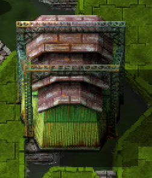

- There is always one in the first locomotive, in the top-middle. It allows you to buy upgrades, linked chests and loaders.
- They spawn randomly with the map with a maximum number of items to buy individual items at a random price.

#### Vehicles
You can't craft any one of those.

They are a map by themselves and you can enter them by using the same key to enter a locomotive, car, train or Spidertrons, by default, the enter key.

The direction you are entering will spawn you on the same edge of that map.

To exit them, you will see cars on the edge of that map. Enter any of those cars.  
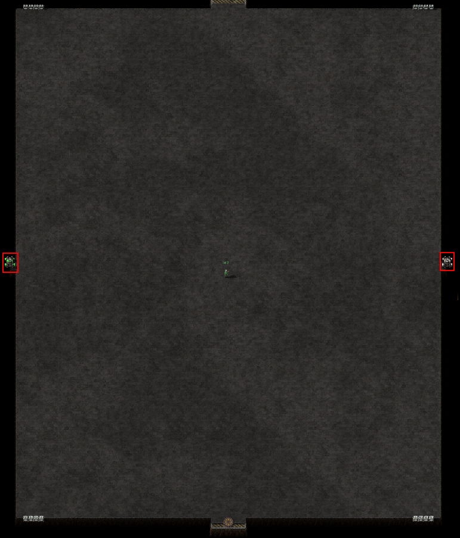

##### Drivable
Once on the map of those vehicles, if you try to leave it, by entering the car, you will be set in the driving seat.

If you want to exit from the driving seat and be back on the main map, press the key to enter/exit.

>[!NOTE]
>As for the locomotive, you will skip the drivable seat if you have modulable armor equipped.

##### Locomotives/Wagons
It is our main base and the most valuable item. If it gets killed the game is over.

You may see a circle, with a very thin border, around the train, when the alternative mode is enabled, we call it the aura.  
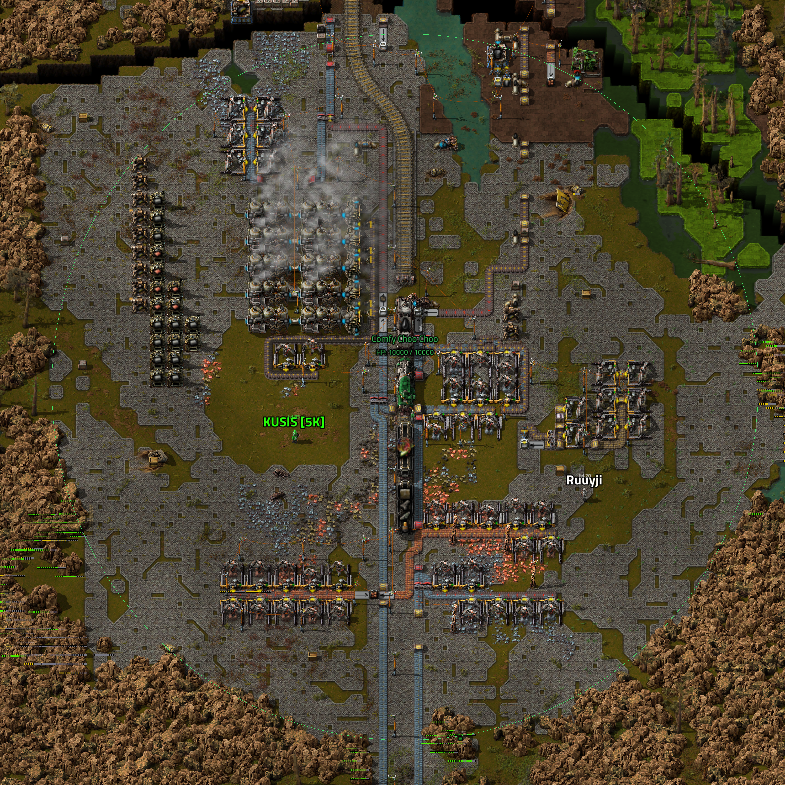

Within that zone:
- You gain more XP mining
- No malus will spawn from removing rocks, trees or wrecks.
>[!CAUTION]
>Do not forget the train is the most important thing in this game. If you mine outside the aura, but near the train, you should take extra care to deal with enemies you may spawn.

>[!CAUTION]
>As a new player, do not drive any train. You may have to drive the main train if it is in immediate danger. Drive it out of the battlefield north but not more. Do not bring it as north as you can.

>[!TIP]
> If somebody is spawning pings (or doing 2-3), without any messages, it likely means the train is under immediate danger. Sometimes, such behavior also means there is a missing pole which prevents lasers from getting power for defense. In rare scenarios, biters/spiters are on the loose somewhere which can be a thread for the main train, or for power poles or mini bases.

>[!CAUTION]
>You can't unlink locomotives/wagons. In case of any doubts, ask players before doing so. The inside map is slightly different for each type of wagon and for locomotive. We want them connected in specific spots, which can lead to skipping some.

>[!NOTE]
>To drive a train you need to remove your modulable armor (otherwise you will go directly on the main map) and put the train in manual mode.

##### Cars
They only spawn from mining rock and they are rare.

>[!TIP]
> We never drive cars

##### Tanks/Spidothon

>[!TIP]
> We never drive tanks

Only available through markets.

As for Spidertrons, we need to unlock them from the market first.

#### Loaders
Act like inserters and also have 3 tiers. The differences are:

- They don't need any energy source
- They take no time to move resources, so they are like belts that can load & unload chests.

They are available to purchase in the market in the main locomotive.

##### How to use them
>[!NOTE]
> If you want to do chest-to-chest you need one at each chest, so you need 2 of them.

- To unload a chest, just place the loader with the arrow toward the belt (like the left side of the picture).

- To load a chest, it is a 2 steps process:
  1. Place the loader with the arrow pointing away from the chest you want to load (in the picture, it is the right chest)
  1. Rotate the loader arrow so it points toward the chest to load.

  ![A 2 steps image of how to use loaders. The first step contains a chest with barrels on the left side, then, on the right, a loader with the arrow pointing to the right. You can see the barrel going out of that loader. On the right of such loader, there is another loader with the arrow pointing left. Finally on the right side an empty chest. The 2nd step: The left chest is now empty, the next loader still points right, and the other loader has been rotated so the arrow now points on the right side. Finally, the last chest contains barels](images/loaders_101.png)

#### Trees
Have a higher enemy spawn rate when removed by weapons
  >[!CAUTION]
  > Do not use explosives since they will spawn a lot of enemies and are likely to become uncontrolled

Green trees will give you iron ores once mined.

Orange trees will give you copper ores once mined.

#### Wrecks
Once mined they will give you items instead of ores.

#### Linked chests (_White chests_)
Cost 200 coins in the main train market. It is a teleporter chest within each wagon. There are 16 of them per wagon (excluding fluid one), 4 per corner.

They only work in the train aura.

If the train aura goes away, it will be automatically unlinked and need to be linked back if the train aura comes back.

##### How to remove them
If it is currently linked, see the ''How to unlink them'' chapter first. Then you will be able to remove it.

##### How to link them
>[!NOTE]
>They can be built only within the main train aura

###### With blueprint
1. Ensure a logistic network is up and in range of your future destination, with at least one linked chest available.
1. Go into the main train
1. Create a blueprint with the linked chest you want to unload to.
1. Exit the main train and paste the blueprint
    >[!NOTE]
    > You cannot use a blueprint to link (assign) the destination on an already-built linked chest. Linkage must be done by hand in that case. Otherwise, if the robot is building the linked chest, it will automatically link it.
1. Let the logistic network build it.

###### Manually - By shared name
1. Enter the main train
1. Locate a linked chest that is empty or not unloading a lot of items, on one of the top, or bottom, edges of the wagons.  
    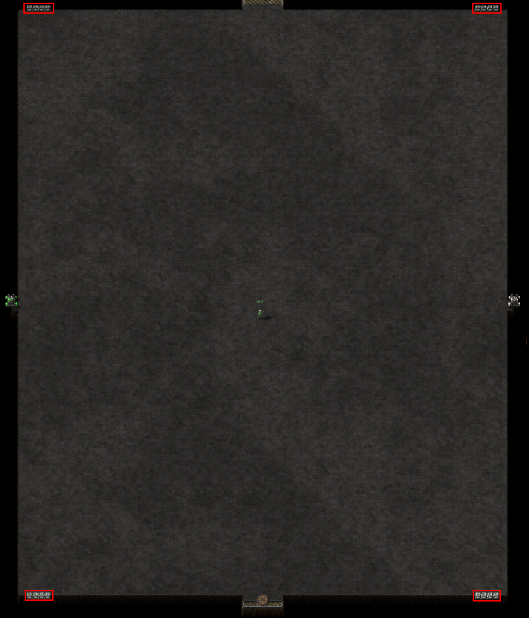

    >[!NOTE]
    >Most of them don't care about what is unloaded.
1. Move close enough to open his inventory.
1. Note the last 4 digits in the middle part of the share name. Also note the position (top-left, top-right, bottom-left, bottom-right) and the position of the chest (between the 4 sets).  
  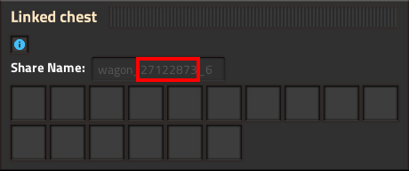
1. Exit the wagon, open the inventory of a linked chest then
  1. Find the carriage (wagon) group that matches the shared name you took note of.
      >[!NOTE]
      >Mouse over any linked chest to see the shared name
  1. Then, in that group, select the linked chest you want to link to.
      >[!TIP]
      > The linked chests are in the same order as in the wagon.  
      The 4 first are the top-left one in the wagon, the 4 next on the top-right in the wagon. The 4 first, on the 2nd line, match the bottom-left ones and, finally, the last four match the bottom-right.  
      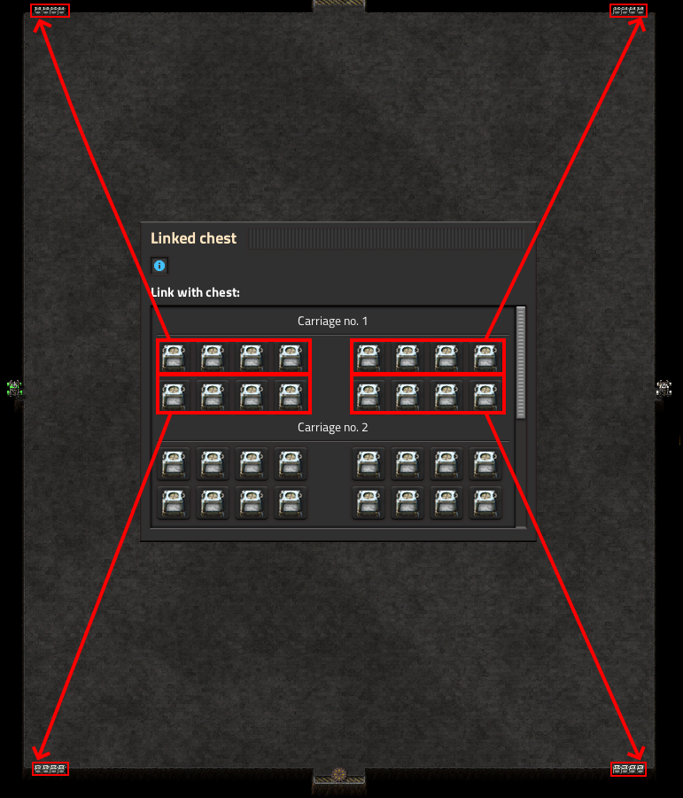

##### How to unlink them
1. The train aura goes away
1. Open the inventory of a linked chest. There will be a checkbox to unlink it, check it.

##### How to manually interact with its contents
The only way to interact with his content is by using the vanilla way of interacting with a chest without the inventory showing up.

- To take items: Without anything in your hand, use the default CTLR+Left Click hotkey on the chest - not in the chest inventory window. Unfortunately, it will take all the chest inventory.
- To add items in the chest: Put items in your hand, and use the default CTRL+Left Click hotkey on the chest - not in the chest inventory window. 

#### Capacitors as an armor charger
Any capacitors with more than 3.0MJ of charge will be able to charge your armor batteries if you are close to them and click the batteries icon on the bottom-right of your screen.  
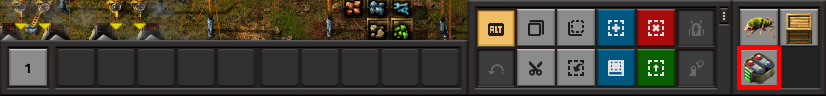

>[!TIP]
>If you put your mouse over the button you will see a description close to this chapter.

#### Unload your inventory
There are various ways to help you unload your inventory into chests and furnaces. You can list them by moving your mouse over the wooden chest icon on the bottom-right of your screen.  
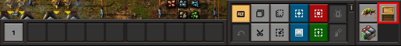

>[!NOTE]
> You must use those hotkeys on the wooden chest icon in order to perform the action

- Left mouse button: Everything, excluding all types in your quick bar slots.
- Right mouse button: Only ores and excluding ore type from all your quick bar.
- CTRL + Right mouse button: Fill nearby furnaces (including with fuel)
- SHIFT + Left mouse button: Everything into filtered slots to nearby wagon/chests inventory
- SHIFT + Right mouse button: Only ores to nearby wagon inventory

### How to get jail/ban
>[!CAUTION]
>This isn't an official list but they are behaviors known to highly screw the game and that cause jail (preventing you to do anything) and ban.

>[!IMPORTANT]
>Usualy, we warn peoples first. In some situations, we may want to clarify the situation before going for jailing or banning you. Be ready to answer if somebody is spawning your name in the chat! Ignoring the chat in this instance will result in jailing you or banning you.

- Using any kind of explosive in a forest. Trees are very good at spawning enemies which often result in uncontrolled ennemies.
- Going to nearby buildings or vehicles when an artillery is shooting at you. Once an artillery shot at you, it will hit your position regardless of where you are going. When you are leaving any artillery line, including when wrapping:
  1. go very slow and stay away from anything other than rocks
  2. if you see any artillery explosion nearby within 5 seconds, go back to step 1. Otherwise, you are now safe to walk away.
- Driving the train without anyone telling you to
  >[!IMPORTANT]
  >Except if the train is under attack. Drive it away from the fight.
- Driving the train as north as you can
- Looting a body without the player consent (if he is playing)
  >[!NOTE]
  > Usually we don't care about low-value items (eg. ores)
- Linking locomotives or wagons without anyone telling you
  >[!NOTE]
  > If we ask you to, be careful of where we ask you to put it. In front or at the end. As for locomotives, it is always in front but we will ask you to align it either toward the train or away from it.
- Getting items from assemblers or belts within the main train. Just ask the logistic bots. If the research hasn't unlocked the item yet, you may want to look at storage chests on the right side of the wagon with the fish in his inventory.
- Removing a power station, or defenses, without a backup.
- Mining and putting at risk, multiple times, any nearby infrastructure.